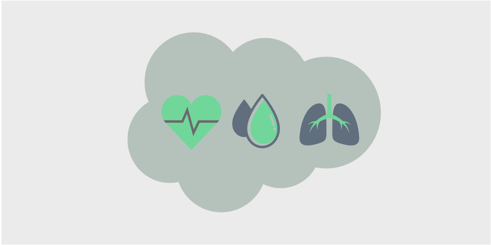
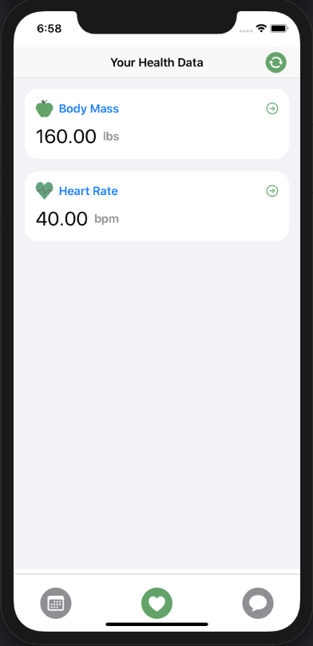
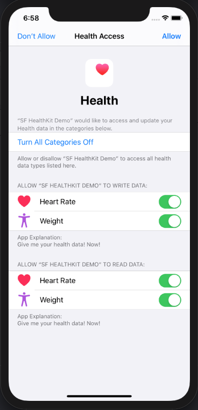
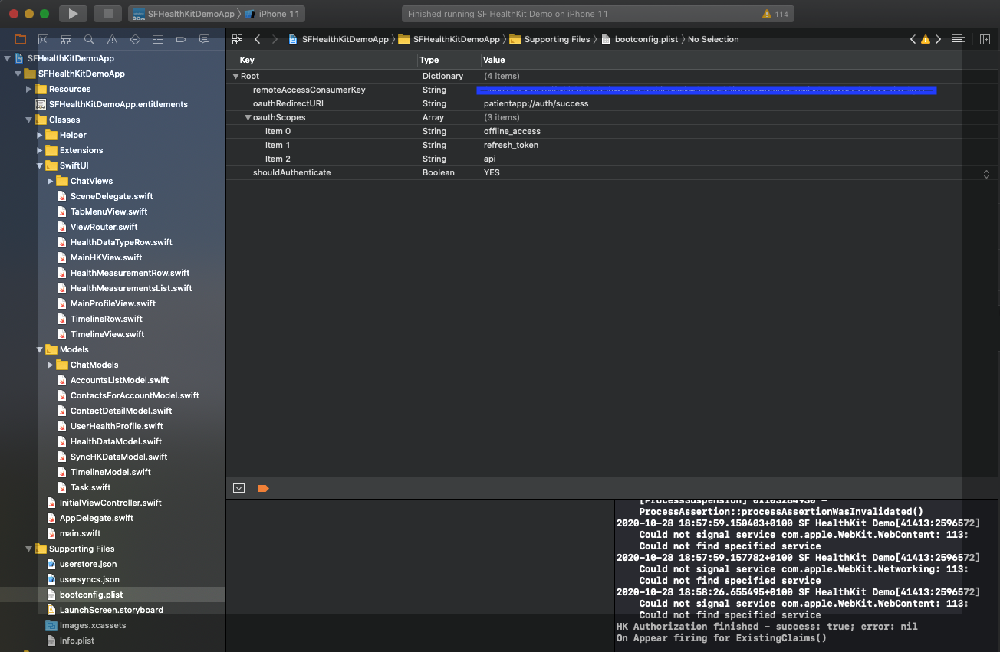

# Saleforce Mobile SDK Demo of HealthKit Integration

This app is a sample application that demonstrates how data collected by Apple HealthKit can be integrated into Mobile SDK app and forwared to Salesforce Health Cloud into Care Observation object.

> IMPORTANT: This is the second part of the reqired setup, for required customizations of your HLS org please refer first to the following repository [here](https://github.com/ygavrylenko/healthkitdemo-sfdx.git).





# Setup Process

1. Clone this repository:

    ```
    git clone https://github.com/ygavrylenko/healthkitdemo.git
    cd healthkitdemo
    ```

2. Install Pod Dependencies (like Salesforce mobile SDK):

    ```
    ./install.js
	```

3. Open Workspace project from toor folder

    ```
    SFHealthKitDemoApp.xcworkspace
    ```

4. Go to **/Supporting Files/bootconfig.plist and replace following entry:

> IMPORTANT: From the Part 1 you extracted **CONSUMER KEY** from connected app "HealthKitDemo Mobile App" 

    ```
    remoteAccessConsumerKey --> "REPLACE_WITH_CONSUMER_KEY"
    oauthRedirectURI --> "patientapp://auth/success"
    oauthScopes --> "offline_access, refresh_token,api" //3 entries, see image below
    ```



5. Go to **/Supporting Files/Info.plist and add following entry (take the patient community endpoint from Part 1). Important: paste it without https// path:

> IMPORTANT: Check that your community active and you have to publish it once! 

    ```
    SFDCOAuthLoginHost --> "sdodemo-main-COMMUNITYURL.force.com/anotherpath"
    ```

 6. Now that's where the rubber hits the road! 
 - Choose your emulator or your iPhone as a target (you have to specify develpment team if you use real iPhone)
 - Build the project, your demo application starts now
 - You should see communty log-in window, enter credentials of your communty patient (e.g. for Charles Green)
 - You have to authorize access to the Apple HealthKit if you start the app for the first time, please allow both type of measurements (Heart Rate and Weight)
 - You should also see some tasks for your patient on the first tab, retrieved from the org, if some exist (if not add some for demo purposes)
 - Before you start, close applicaton and enter some values in your HealthKit (you can do it manually)
 - Click on the tab in the middle, you should see the values from HealthKit
 - Click on arrow button in order to synchronize the data to health cloud
 - Change to health cloud, now you should see the measurements as CareObservation objects in related list of your community patient! 

## Read All About It

- [Trailhead: XCode Essentials](https://trailhead.salesforce.com/en/content/learn/modules/xcode-essentials)
- [Trailhead Project Mini-Hack: iOS and Salesforce Mobile SDK](https://trailhead.salesforce.com/en/content/learn/projects/mini-hack-mobile-sdk-ios)
- [Trailhead: Swift Essentials](https://trailhead.salesforce.com/en/content/learn/modules/swift-essentials)
- [Trailhead Modern Mobile Development for iOS](https://trailhead.salesforce.com/content/learn/modules/modern-mobile-development-ios?trail_id=start-ios-appdev)
